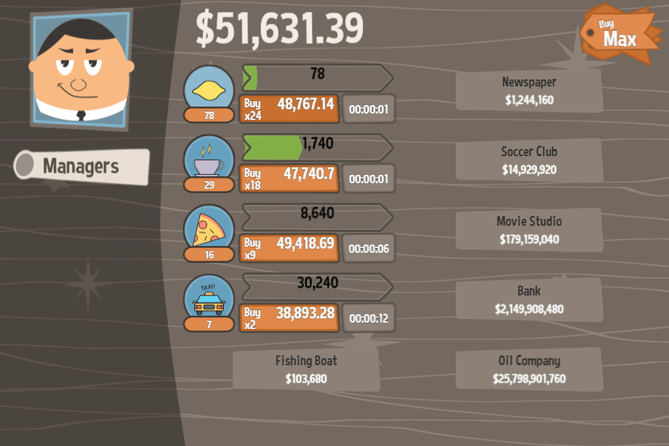

# Clone Capitalist

## License
https://www.gnu.org/licenses/gpl-3.0.en.html

## Install And Run

Install Parcel, if not already installed:

``` bash
npm install -g parcel-bundler
```

Back in 2019, parcel v1 was available, right now it's deprecated. Feel free to upgrade it, if you so desire.

Install dependencies and run with:
```bash
npm install
npm run start
```

## Word Of Advice For Coders
If you are applying for this company and receive this coding challenge, please consider doing it yourself.

## Word Of Advice For Companies/Recruiters
If you're eye-balling me for a game dev position that requires Javascript or Typescript and your recruiting process includes a coding challenge, I'll respectfully deny it and point you here. I'm not really 
keen on spending another 6-8 hours doing the same thing ;)

## Overview
This project was done for a coding challenge/take-home assignment for a game development company. You can read the details about the interview process here: https://www.pirongames.com/clone-capitalist-source-code-released-and-more-on-coding-challenges/

The solution focuses on front-end, getting the look and feel of the game as faithful as possible to the original. Polishing the visuals as much 
as possible was a priority for this challenge.

Since Cocos Creator was banned from this challenge (which is my tool of choice for creating HTML5 games), I have chosen Phaser 3 as a framework. Before this challenge, I've never worked with Phaser.

The whole project was developed in 16 hours: 5 hours were spent learning Phaser, about 3 hours on creating the graphics (well, cloning), 
and 8 hours on the game coding and testing.

## Screeshots



## Art&Art Pipeline
Graphics were created from scratch using Inkscape. The master graphics file is located in assets-dev\art\general

I have chosen to group smaller graphics into an atlas (for performance reasons) and bigger assets (backgrounds) into separate files.

The atlas is created using Shoebox (https://renderhjs.net/shoebox/). To update it:
* export necessary assets from Inkscape to assets-dev\art\export;
* open assets-dev\art\main-atlas-phaser.sbx;
* drop assets-dev\art\export\main folder into Shoebox
* save the atlas;
* move it over to public\sprites folder.

## Architecture
I have tried to use as much as possible the features built in Phaser, like the registry and event system, to see how they would fit such 
a game. 

The registry system is used as a "service locator", which is a dated design pattern.

I have used the Phaser event system, but it ended up in complicated code to communicate between multiple scenes. Using signals would make for a
better approach.

I'm mixing liberally UI and logic code, especially BussinessCard class is such an example. In some cases, for ultra-specialized UI components like BusinessCard or
HireManagerCard, it's not a big problem, but for better architecture, view logic should be extracted into a mediator and application logic into commands/services.

Also, some classes have too many responsabilities (like PlayerModel).

My choices usually gravitate toward using a DI container and signals, and perhaps setting an architecture close to RobotLegs (model-view-mediator-service). 
However, time was too short in implementing from scratch such architecture for this challenge.

## Improvements/Limitations/Trade-offs
Numbers (for cash, costs, etc) in the prototype are plain Javascript number type. In the real game, something like bignumber.js should be used to represent these
values, as they can get ridiculously large.

Phaser has certain limitations on using masks in containers, so the green arrow progress bar is not looking perfectly right.

Some of the code (models, services) would benefit from unit testing.

I have chosen a containerized approach to represent UI elements. For example, each BusinessCard will hold in a Phaser Container graphics, text and 
interactive elements. However, this is not very performant as it increases draw calls. Text elements should be extracted on a separate layer and not 
mixed with graphics elements.

A statistics popup was planned, but abandoned due to time constraints.

The game was not tested on mobile browsers.

There is no visual preloading progress, as the game assets are quite small (~300kb).

There is no way to reset the game, except for manually deleting the local storage.

There is no localization support and all strings are hard-coded. Typically, I would use Airbnb polyglot library to handle localization.

Haven't finished configuring the ESLint rules as the IntelliJ IDEA I was using is kind of old and crashes with eslint.